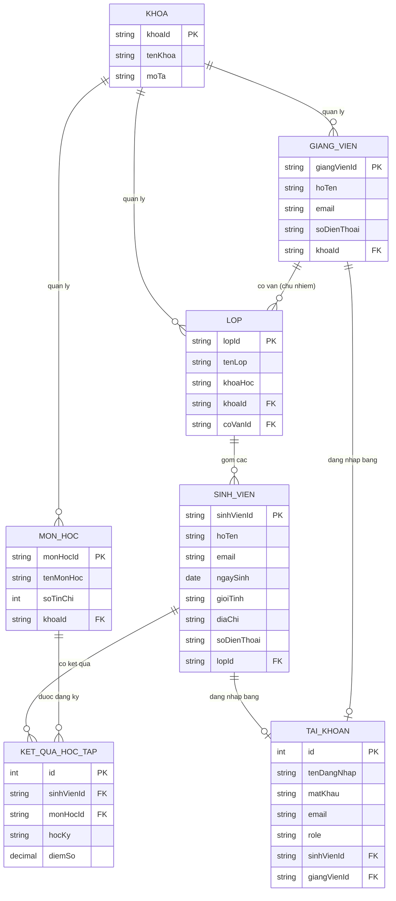

# So do lop (Class Diagram / ERD) - He thong Quan ly Sinh vien

Day la ket qua buoc **phan tich & thao luan** cua nhom truoc khi tien hanh code Entity,
dap ung yeu cau cua giao vien: *"phai thuc hien thao luan, phan tich de dua ra duoc bieu do lop cua Project truoc khi thuc hien Entity"*.

## Giai thich cac quyet dinh thiet ke

1. **KET_QUA_HOC_TAP** la bang lien ket (associative entity) giai quyet quan he N-N giua
   `SINH_VIEN` va `MON_HOC` — 1 sinh vien hoc nhieu mon, 1 mon co nhieu sinh vien hoc,
   moi cap (sinh vien, mon hoc, hoc ky) co 1 diem so rieng.
2. **LOP** co quan he N-1 toi `GIANG_VIEN` thong qua `coVanId`, dai dien cho vai tro
   Co van hoc tap / Giao vien chu nhiem — 1 giang vien co the phu trach nhieu lop,
   nhung 1 lop chi co 1 co van tai 1 thoi diem.
3. **TAI_KHOAN** duoc tach rieng khoi `SINH_VIEN`/`GIANG_VIEN` de mo hinh dung dung nghiep vu:
   khong phai Sinh vien/Giang vien nao cung can (hoac da co) tai khoan dang nhap he thong
   ngay tu dau, va 1 nguoi chi nen co dung 1 tai khoan (quan he 1-1 tuy chon).
